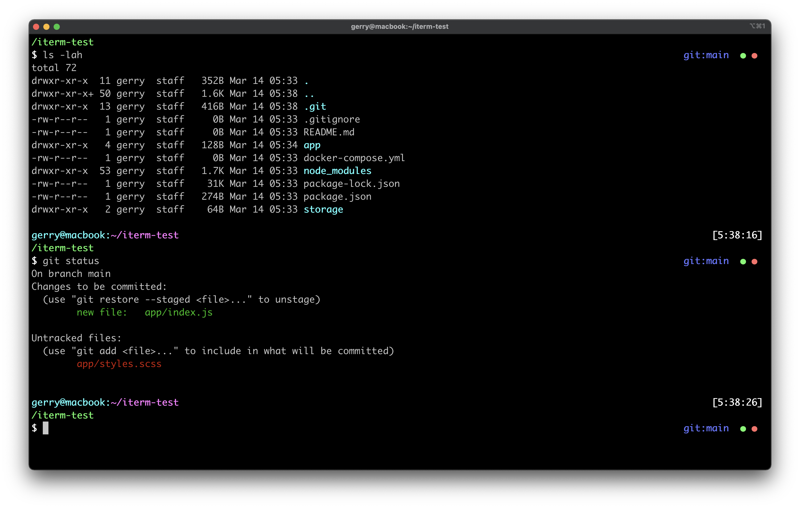

# gerry-prompt



My personal and fast ZSH prompt with git status based on [bureau](https://github.com/ohmyzsh/ohmyzsh/wiki/themes#bureau).

It shows on the left:

* User name
* Host name
* Current path.

On the right:

* Current time
* Current git branch (called `main` on screenshot)
* staged and unstaged files (green and red bullets)

## Install

To install the theme, copy the [`gerry.zsh-theme`](gerry.zsh-theme) file under `~/.zshrc/themes`.
Then, to enable it, set `ZSH_THEME` to `gerry` in your `~/.zshrc`, before sourcing Oh My Zsh.

```bash
# ~/.zshrc

ZSH_THEME="gerry"
```
